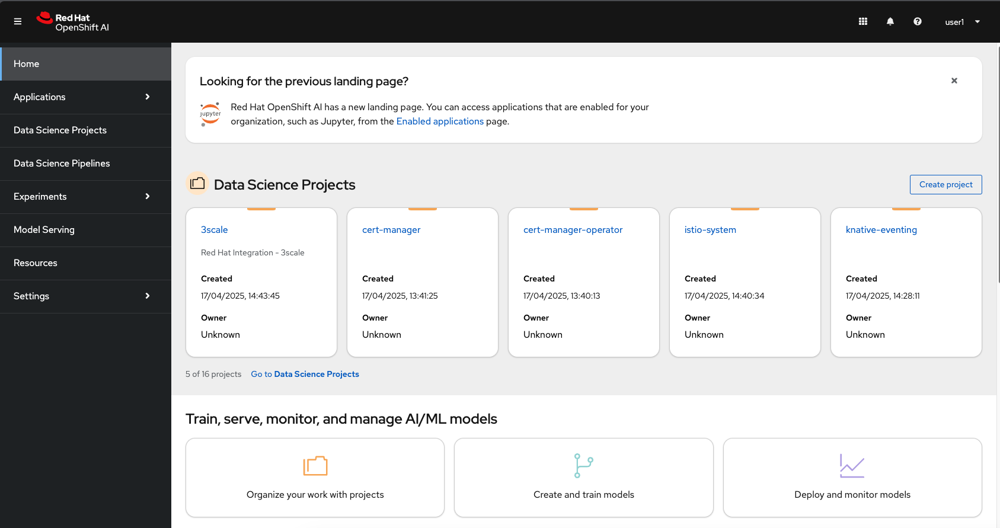
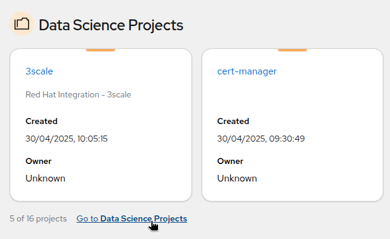
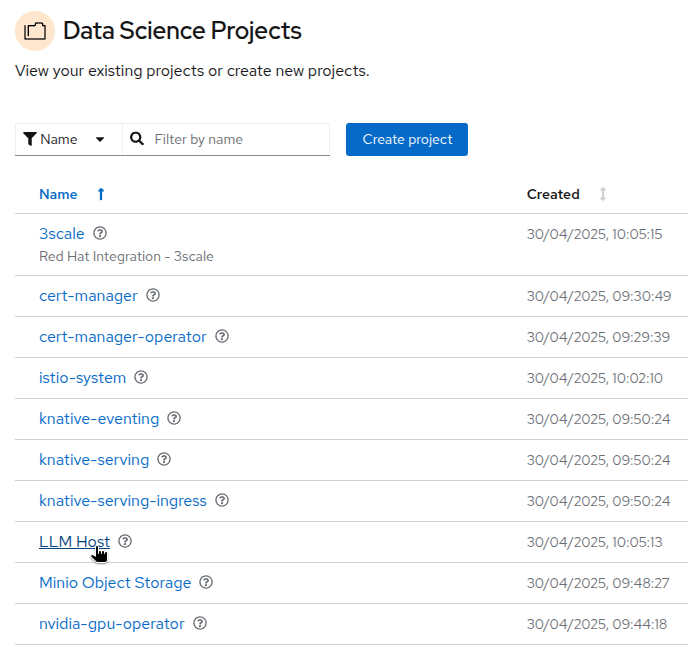
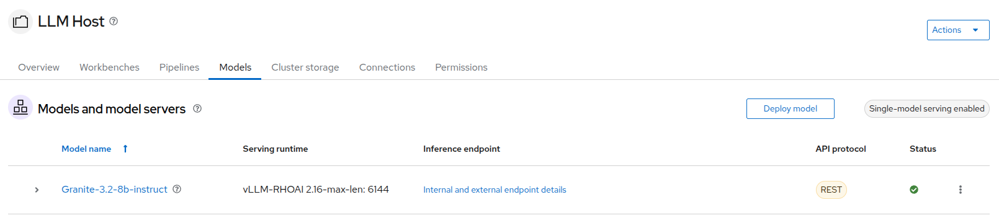
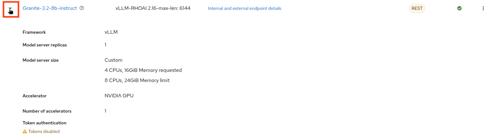
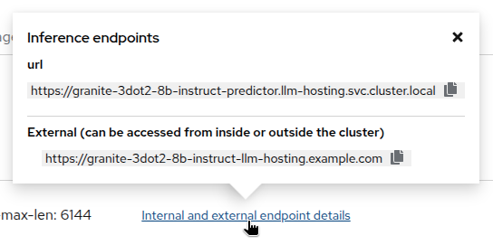
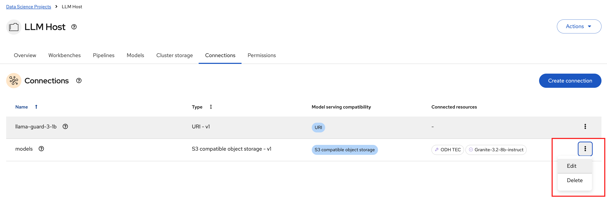
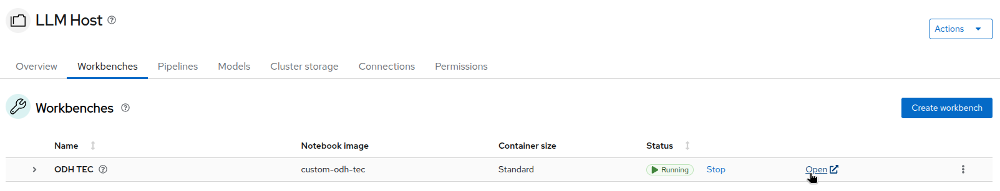

= Model Deployment and Configuration

First, we will quickly review the different OpenShift AI components, and learn how to deploy a model with it.

[#getting-connected]
== Getting connected to OpenShift AI

If you are accessing these instructions through the workshop, the information below will render properly with unique values. If you are accessing the instructions separately for your own cluster, you will see placeholder values instead.

* Your username: `{user}`
* Your password: `{password}`

At any point, you can access the OpenShift Container Platform web console by going to the following URL: https://console-openshift-console.{openshift_cluster_ingress_domain}/[https://console-openshift-console.{openshift_cluster_ingress_domain}/,window=_blank]. This link is also available in the `Links` section in the top right corner of the present instructions.

For now, we are going to use the OpenShift AI Dashboard, which is a web-based interface that allows you to manage and monitor your OpenShift AI environment.

* Click to open the following URL in a new tab or window and log in:
** https://rhods-dashboard-redhat-ods-applications.{openshift_cluster_ingress_domain}/[https://rhods-dashboard-redhat-ods-applications.{openshift_cluster_ingress_domain}/,window=_blank]
* Click on the `Login with OpenShift` button:
+
[.bordershadow]
image::../assets/images/02/02-01-login3.png[]

* Select rhsso
+
[.bordershadow]
image::../assets/images/02/02-01-rhsso.png[]

* If needed, enter your credentials (as detailed above)
+
[.bordershadow]
image::../assets/images/02/02-01-login1.png[]

* Because the password is so simple (`{password}`), your browser might display a scary message. It is safe here to ignore this message when it pops up. 
* Don't worry if you do not see this scary message.

* After you authenticate, your browser window should look like:
+
[.bordershadow]

If you got this far, congratulations, you properly connected to the {rhoai} Dashboard Application!

We are now ready to begin!

[#openshift-ai-overview]
== OpenShift AI Overview 

OpenShift AI is a managed platform for building, training, deploying, and monitoring AI/ML models on Red Hat OpenShift. It provides an integrated environment for data scientists, ML engineers, and developers to collaborate using Jupyter notebooks, model development tools, and scalable infrastructure. OpenShift AI allows you to work with both open source and commercial AI tools, integrates with Kubernetes-native workflows, and enables secure, compliant, and reproducible ML pipelines.

=== OpenShift AI: Key Components

In this section, we will review the different OpenShift AI components within the Dashboard and discuss their features.

==== Selecting the Data Science Project

* As you are cluster admin, you currently see many projects. The one we will be using in the workshop is the `LLM Host` project. To access it, click on `Go to Data Science Projects` at the bottom of the Data Science Projects sections.
+
[.bordershadow]

* In the list of projects, you should see the `LLM Host` project. Click on it to access the project.
+
[.bordershadow]

==== OpenShift AI Components

[.bordershadow]
image::../assets/images/02/02-project-tabs.png[]

Within data science projects are the following components. You may access each through the various tabs of the project UI view:

* **Workbench**: This is where you can create and manage various development environments like JupyterLab, VSCode, or other custom Workbenches. It provides a user-friendly interface for data scientists to work with notebooks, libraries, and datasets. There is already a Custom Workbench deployed in the project to explore the storage space where our models are. We will come to it later.
* **Pipelines**: We won't use Pipelines in this workshop, but you can use them to automate the process of processing date or training and deploying machine learning models.
* **Models**: This is where you can manage and deploy machine learning models. You can create, update, and delete models, as well as monitor their performance and usage. You can see that a model is already deployed as an example. We will come to it later.
* **Cluster storage**: This is where you can manage the storage resources used by your models and workbenches. You can create, update, and delete storage resources, as well as monitor their usage. At the moment you can see the storage used by the workbench we deployed.
* **Connections**: This is where you can manage the connections between your workbenches or model runtimes and other services, such as storage (S3), databases or APIs. You can create, update, and delete connections, as well as see which environment is using them.
* **Permissions**: This is where you can manage the permissions for project. You can create, update, and delete permissions, as well as see which users or groups have access to which resources.

[#reviewing-deployed-model]
== Reviewing the Deployed Model

=== Reviewing the Model Configuration

* As we mentioned before, a model is already deployed in the `LLM Host` project. To access it, click on the `Models` tab in the project. The model deployed is the `Granite-3.2` model. It is designed to generate human-like text and can be used for various natural language processing tasks.
+
[.bordershadow]

* If you click on the expand button at the left of the model, you will see more information about its configuration, such as the resources allocated to it.
+
[.bordershadow]

* If you click on `Internal endpoint details`, you will see the different endpoints available for the model. The `Internal` endpoint is used to access the model from within the OpenShift cluster. The `External` endpoint would be used to access the model from outside the cluster, but in this case the model is only accessible internally.
+
[.bordershadow]

At this point, you can see that the model is running and ready to be used. 

=== Reviewing the Connection

* Switching to the `Connections` tab, you can see there is already a connection called `models` configured in the project.
+
[.bordershadow]
image::../assets/images/02/02-connections-models-overview.png[]

You can see that the `Granite` model serving is using this connection, as well as the `ODH-TEC` workbench which we will explore later.

* Let's take a look at its configuration. Click on the three dots on the right of the connection and select `Edit`.
+
[.bordershadow]

* You will see that this is an S3 connection to object storage provided by Minio. Scrolling down, you can see the different parameters configured for this connection.
+
[.bordershadow]
image::../assets/images/02/02-models-connection-details.png[]

The `Access Key` and `Secret Key` are used to authenticate to the Minio server, while the `Bucket` parameter is used to specify the bucket where the models are stored. The `Endpoint` parameter is used to specify the Minio server address.

Those information will be **automatically injected** as **environment variables** in the model runtime or the workbench that use this connection, so you don't need to worry about them and have to set those parameters manually every time. That's both a **time saver and a security feature**, as you don't have to expose those credentials in your code.

=== Reviewing the Model Files

* As we said, the model is stored in Minio, which is an S3 compatible object storage. To see those files we are going to use the `ODH-TEC` workbench that is already deployed in the project. To access it, click on the `Workbench` tab in the project, then on the ODH-TEC hyperlink.
+
[.bordershadow]

* This will open a new tab. After logging in and accepting the license, you will access `ODH-TEC`. It is a simple tool used to manage and view S3 storage.
+
[.bordershadow]
image::../assets/images/02/02-odh-tec.png[]

As you can see, `ODH-TEC` is already configured to use the **`models` connection** we just reviewed. You can see the different buckets available in the Minio server, as well as the files stored in each bucket. You can take some time to look at the different folders and files available. 

You will see two models. The TinyLlama model will only be used in a later optional exercise. You may close this tab. 

Congratulations, you have been introduced to the OpenShift AI Dashboard and we have a successfully deployed model for use. We will now expose the model through the 3Scale API Gateway in our environment and subsequently use this connection in several use case scenarios.