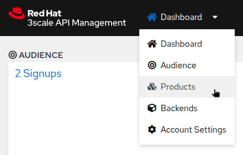
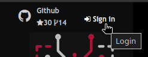
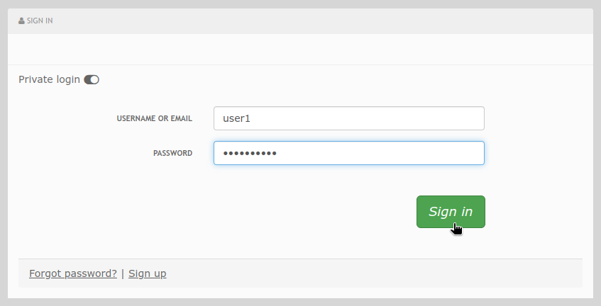
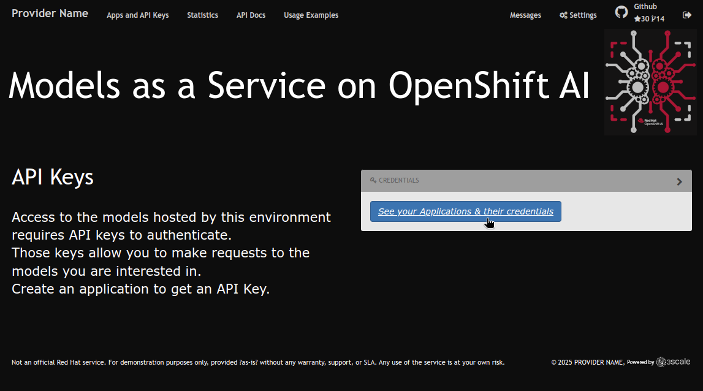
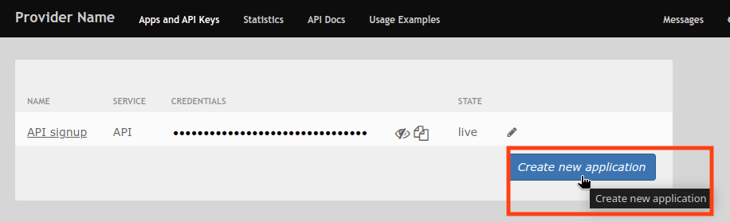
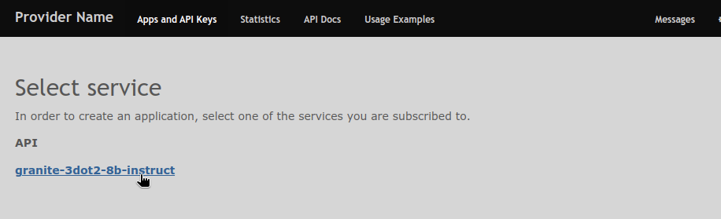

= AI at Scale with an API Gateway

Now, in this next step, you will learn how to configure 3Scale API Gateway to give access to the model deployed in the previous module.

// More info explaining how API gateway facilitates "model as a service" functionality.

[#3scale-overview]
== API Gateway Overview: Why It Matters

Having an enterprise-grade API management platform is critical to help organizations secure, monitor, monetize, and scale their APIs. As APIs become critical business assets—powering apps, integrations, and services—a powerful API management platform provides the governance needed to deliver them securely and reliably at scale. 

3Scale is the API management platform we will use in our workshop today, but you may also imagine any preferred API gateway easily substituted into our experience.

Within the 3Scale administration profile you may create and manage API keys, set up rate limits, and monitor API usage across users. 

=== Connection to 3Scale Admin Portal

To connect to the 3Scale admin portal, you will need the admin_user and admin_password values. They can be found in the `system-seed` secret in the `3scale` namespace.

* From a Terminal (in your OpenShift console) you will run a single command to retrieve these values. 

You may also retrieve them by navigating to the location of the secret in the OpenShift console.
+

1. Navigate to the OpenShift console

2. Select the terminal icon in the top navigation bar

image::../assets/images/02/open-terminal.png[]

3. Copy the following command into the terminal session:
+
[source,bash,role="execute",subs="+macros,+attributes"]
----
oc get secret system-seed -n 3scale -o template='{{range $key, $value := .data}}{{if or (eq $key "ADMIN_USER") (eq $key "ADMIN_PASSWORD")}}{{printf "%s: " $key}}{{ $value | base64decode }}{{"\n"}}{{end}}{{end}}'
----

Now, you can log into the 3Scale admin portal at https://maas-admin.{openshift_cluster_ingress_domain}/[https://maas-admin.{openshift_cluster_ingress_domain}/,window=_blank] using the credentials you just retrieved.

You will be prompted by a wizard window. Close it by clicking on the top right corner of the screen.

[.bordershadow]
image::../assets/images/03/03-3scale-close-wizard.png[]

=== 3Scale Admin Portal

3Scale admin portal is where you can manage your APIs, create applications, and set up access control. You can also monitor API usage and set up rate limits.

The dashboard is divided into several sections:

* **Audience**: this gives you information about the users, registrations, etc.
* **APIs**
** **Products**: this is where you can create the Products that people will have access to. You can see there are two products already created: `granite-3dot2-8b-instruct`, which is connected to the model that was pre-deployed,  and `API`, which is a default 3Scale echo API for testing.
** **Backends**: this is where you can see the backends that can be used by your products. You can see that the `granite-3dot2-8b-instruct` backend that is used by the the `granite-3dot2-8b-instruct` product.
+
[.bordershadow]
image::../assets/images/03/03-3scale-admin-dashboard.png[]

Using the dropdown menu at the top, you can access and explore the different admin sections: Audience, Products, Backends, and Account Settings.

[.bordershadow]

This workshop is not a full tutorial on 3Scale, so we will not go into details about the different sections. You can find more information in the https://docs.redhat.com/en/documentation/red_hat_3scale_api_management/2.15[3Scale documentation,window=_blank].

=== Subscribing a User to a Service

A user was already created for you in 3Scale in (Audience->Accounts->Listing). In this configuration, our user is automatically subscribed to the `granite-3dot2-8b-instruct` service. In a production environment, you would normally automate this process as part of the deployment of a new product. 

[#3scale-dev-portal]
== Developer Portal

=== Accessing the Developer Portal

You can now access the developer portal at https://maas.{openshift_cluster_ingress_domain}[https://maas.{openshift_cluster_ingress_domain},window=_blank].

You can log in using your workshop credentials, because they are the ones we used to pre-create a user in 3Scale.

Here they are again:

* Your username: `{user}`
* Your password: `{password}`

Signing in:

* Click on the `Sign In` button in the top right corner of the screen
+
[.bordershadow]

* Click on `Private login` and enter your credentials.
+
[.bordershadow]

You should now be logged into the developer portal. You will be able to see the APIs that are available to you, and you can also create applications to get API keys.

[.bordershadow]
image::../assets/images/03/03-3scale-developer-loggedin.png[]

=== Creating an Application

Creating an application is the first step to getting an API key.

* Click on the `See your Applications and their credentials` link on the front page.
+
[.bordershadow]

* You will be taken to the `Apps and API Keys` section, where you can see that there is an application that was already created for you (the 3Scale default Echo API). Start creating a new application by clicking on the `Create new application` button.
+
[.bordershadow]

* Select the Service you want to use. In this case, we will use the `granite-3dot2-8b-instruct` service that has been pre-deployed.
+
[.bordershadow]

* Give a name to your application, for example `Granite application`. Click on `Create Application`.
+
[.bordershadow]
image::../assets/images/03/03-3scale-application-name.png[]

* Your application has been created. You can see the Endpoint URL you can use to connect to the API, the name of the model you must use in your requests, and the API key that has been generated for you. We will now use this key to access the API.

Save this information as you will use it in the next module. 
+
[.bordershadow]
image::../assets/images/03/03-3scale-key-generated.png[]