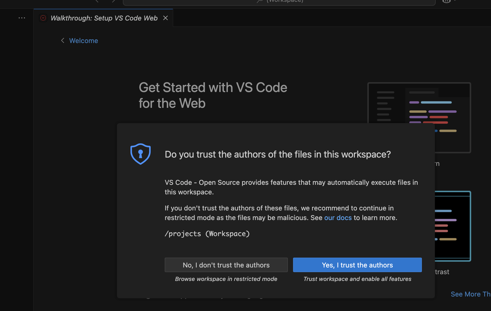
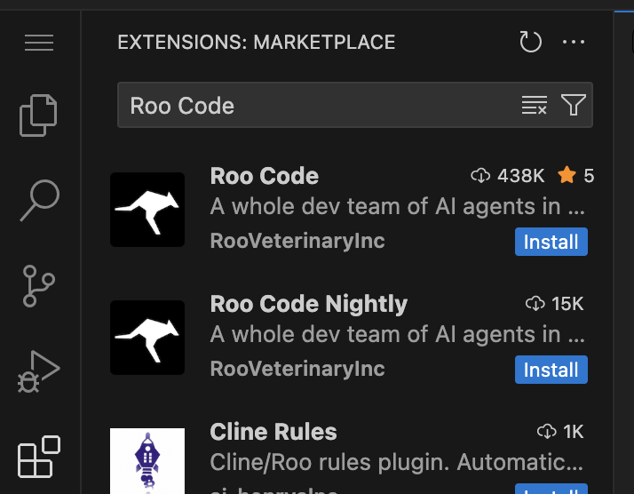
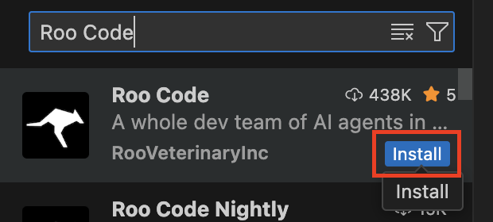
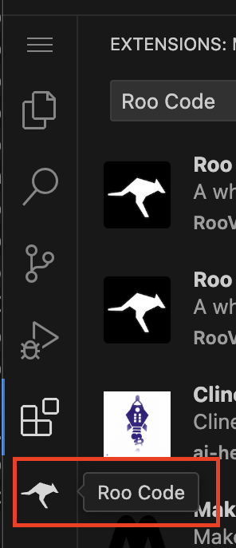
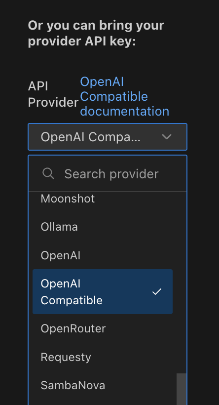
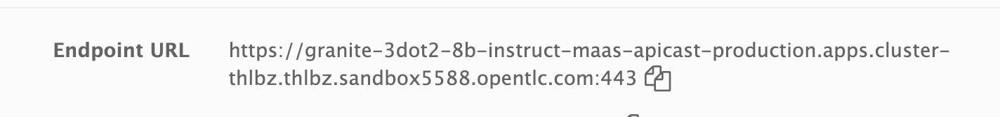
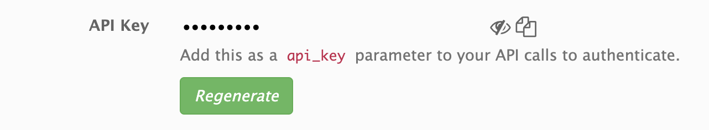
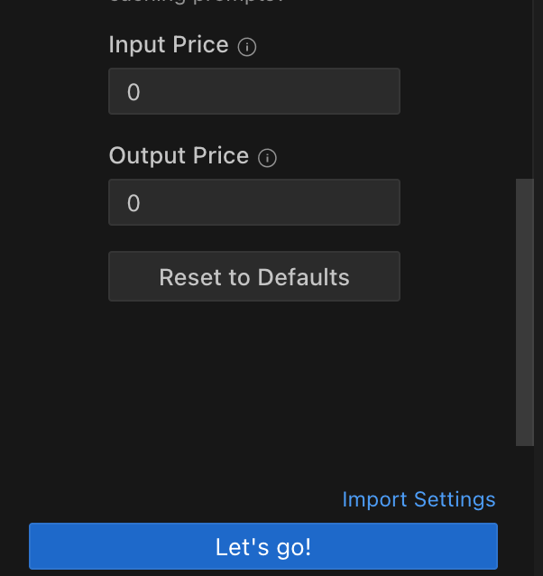

= [Module 2] Coding with AI

Welcome to the next stage of our journey!

In this module, we’ll step into the shoes of a developer. 

== Introduction to Code Assistants

When we think of code assistants, we might imagine simple autocomplete or boilerplate generators. But today’s tools have evolved into powerful, intelligent collaborators—and they’re changing how we write software.

Modern code assistants are powered by large language models (LLMs) trained on vast amounts of code, technical documentation, and development patterns. But the real value comes from how they integrate into your workflow—right inside tools like Visual Studio Code—to help you plan, write, review, and refactor your code in real time.

What Modern Code Assistants Can Do:

**Understand Full Project Context**: Assistants like Cursor, GitHub Copilot, and Roo can read across files and directories, understanding how your code fits together.

**Edit with Natural Language**: You can describe a change—like “add error handling here” or “convert this to async”—and assistants like Roo, Continue, or CodeWhisperer will apply it intelligently.

**Proactively Suggest Improvements**: They catch bugs, highlight inefficiencies, and recommend best-practice patterns.

**Automate Tedious Tasks**: From generating unit tests and docstrings to scaffolding boilerplate or renaming variables across a project—they take care of the grunt work so you can focus on logic and design.

These assistants don’t just write code - they understand your project and help you build better software faster. And the best part? Most of them work seamlessly inside popular IDE's like Visual Studio Code, so you don’t need to switch tools to get started.

Sounds pretty useful right? Let's dive in. 

== Setting Up the Code Assistant in VSCode

[#dev-spaces-interface]
== Using OpenShift Dev Spaces

We're going to use VSCode via OpenShift DevSpaces, so - let me tell you what that is.

OpenShift Dev Spaces is a cloud-based development environment platform that gives developers instant access to pre-configured, containerized workspaces—all running securely on your OpenShift cluster.

Instead of asking every developer to configure their laptop or match local environments, Dev Spaces provides on-demand VS Code-like workspaces.

That being said, of course you could connect to the remote model endpoint via any preferred IDE. We wanted to call out DevSpaces for a few reasons:

* Consistent
* Fast to Onboard
* Secure and Centralized
* Repeatable

=== Access OpenShift DevSpaces Console

As a developer on a large team, you’ll typically be granted direct access to the OpenShift Dev Spaces console through a dedicated URL provided by your platform administrator or team lead. This ensures you don’t need to navigate through the full OpenShift web console or manage cluster-level details. However, if needed, you can access Dev Spaces from within the OpenShift console under the **Developer Perspective → Dev Spaces**. Once logged in, you’ll see a personalized dashboard where you can launch your workspace with just a few clicks.

=== Select Your Workspace

We have a workspace ready for your use with VSCode and the necessary dependencies. As a developer, you can also create your own workspace without needing to install or configure anything locally. There may however, be some restrictions put in place by your admin around resource limitations or only using approved devfiles (yaml files used to instantiate new workspaces).

Select the `Open` hyperlink next to the pre-created workspace:

image::../assets/images/code/workspace_preset.png[]

It will take a moment for the workspace to start. Once ready, you will see the VSCode interface.

It may ask you to trust the authors. We're not so bad, so go ahead and click "Trust". 

Within the workspace, we already have our working repository cloned from GitHub ready for us to work within. We'll get to this in a moment. First, we need to set up our code extension.

[#roo-continue-dev]
== Experience the Power of Coding with AI

=== Introducing Roo

Let's meet Roo!

Roo is more than a code extension, it's an AI-powered coding teammate, built to help you write, understand, and refactor code directly inside VSCode.

Unlike traditional code completion tools, Roo is an intelligent, task-driven assistant that you can talk to. You can ask Roo to perform actions like:

**“Add logging to this function”**

**“Generate a unit test for this file”**

**“Refactor this into smaller components”**

**“Explain what this code does”**

And Roo will do it—right in your project, with full awareness of your codebase. 

Many leading code extensions operate in similar ways, and Roo is a great **open-source** example of what AI coding can help us be capable of. 

=== Install the Roo Code Extension

Select the bottom navigation item on the left-hand side to open up the extensions marketplace.

image::../assets/images/code/extensions_tab.png[width=100%]

In the search bar, search for **Roo Code**. You'll see it as the top option, as shown below:

Click **Install**

You may get another trust verification message. Select **Trust Publisher & Install**.

Once installed, click on the arrow next to Uninstall -> Install Specific Version as seen below. We are going to select a specific version to install since things move so quickly around here!

Click **Install Specific Version...**

image::../assets/images/code/install_specific_version.png[]

You will see a drop-down appear with different versions. Please select **v3.25.6**.

Once done installing the proper version, click **Reload Window**

Now, we're ready to configure our model connection!

== Setup our Code Assistant

Navigate to the Roo Code extension in the left-hand side navigation bar:

We will do two things in this module:

1. Connect to our Granite model within our company's MaaS platform
2. Use our model's "brain" to help us build a Kubernetes deployment

In order to connect our model to the Roo Code extension we must provide the extension our model's API key from our MaaS application in the previous module (if you did not document the API key and URL from the previous step, please go back to the developer portal and grab that information).

Developer Portal: https://maas.{openshift_cluster_ingress_domain}[https://maas.{openshift_cluster_ingress_domain},window=_blank].

=== Input Model Information

1. API Provider field, select **OpenAI Compatible** 

2. Base URL: the Endpoint URL from our MaaS application. **Add /v1 to the end of the URL.**

3. API Key: The API Key from the MaaS application.

4. Model: Select the Granite model from the dropdown (this will populate after inputting the above URL and API Key information)

image:../assets/images/code/model_name.png[]

5. Leave all other fields in their default positions. Select `Let's go!` at the bottom of the form.

Now the model is set and we are ready for our coding activity.