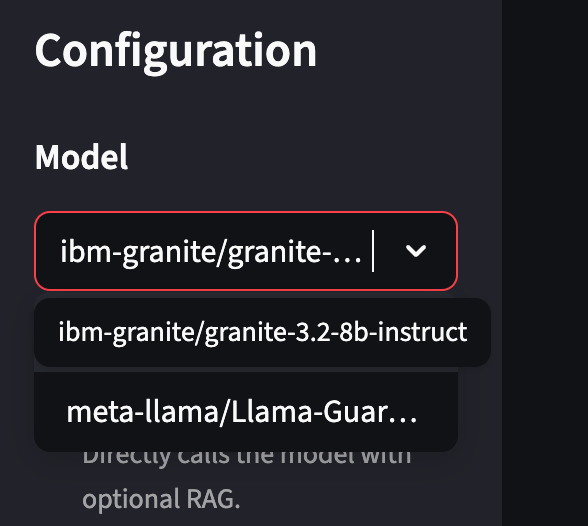
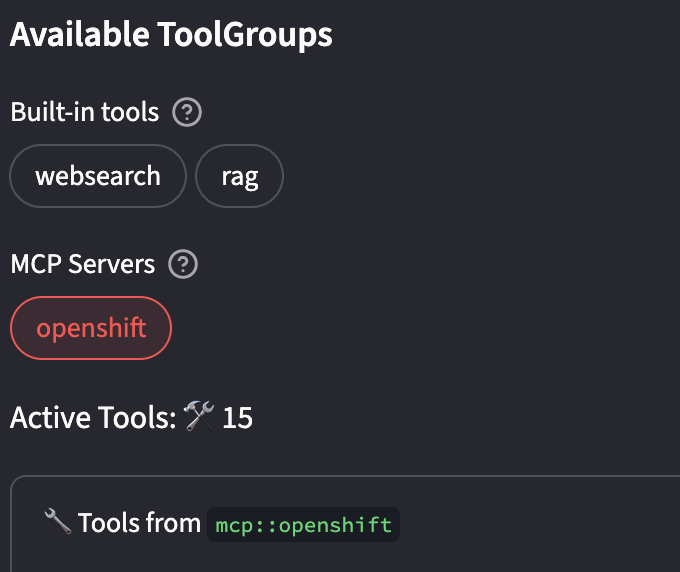

= [Module 3] System Administration with Agentic AI 

In the previous module, we explored how developers can use a remote model to summarize call center support tickets. Now, we’ll shift perspectives—this time stepping into the shoes of a platform engineer or cluster administrator.

But we’re not leaving AI behind. Instead, we’ll take things a step further by integrating our model endpoint into a broader agentic AI system, capable of reasoning, querying, and navigating a real OpenShift environment.

This hands-on module introduces agentic AI for system administration—not to replace cluster operators, but to augment them with natural language insight, real-time system awareness, and intelligent recommendations.

== Why This Matters: Business Value of Agentic AI for Admin Tasks
As organizations adopt more complex AI and cloud-native workloads, the cognitive burden on DevOps teams grows exponentially. Infrastructure teams often rely on complex dashboards, alerts, and scripting to maintain visibility. Now imagine being able to just ask a question like:

* “What’s consuming the most memory in our dev cluster right now?”

* “Were there any pod crashes in the last 30 minutes?”

* “Why did that Job fail this morning?”

Agentic AI, built with frameworks like LlamaStack, which we'll discuss in a moment, lets you answer those questions using plain language and real-time system context. The result? Faster issue resolution, increased system transparency, and lower barrier to operational insights for both technical and non-technical users.

== Introducing LlamaStack
https://github.com/meta-llama/llama-stack[LlamaStack] is a flexible open-source framework developed by Meta to simplify the creation and deployment of advanced AI applications—including those with agentic capabilities.

LlamaStack makes it easier to build AI agents that don’t just generate text, but can reason, use tools, search the web, retrieve documents, and interact with live infrastructure.

Why It Matters for Enterprises:

**Codifies best practices across Gen AI tools**

**Enables reproducible, explainable, and extensible AI workflows**

In short, it lets you focus on value creation, not toolchain assembly.

=== Built-In Tools We’ll Use

We’ve pre-integrated the following tools for this module:

**🧠 RAG (Retrieval-Augmented Generation)**
Pulls relevant info from documents or cluster logs before generating an answer

Example: “What do logs say about the last pod failure?”

**🔍 WebSearch**
Queries real-time external data via Tavily

Example: “What’s the latest vulnerability affecting Redis deployments?”

**📊 OpenShift MCP Server**
Allows LLM agents to interact with the live OpenShift cluster through a standardized, read-only interface (no kubectl required)

Ideal for safe observability and diagnostics

== Setup the Chat Application Interface

Navigate to the LlamaStack playground.

//URL Info, get through cluster interface?

// image

Within the application you'll find a familiar chat interface with some selection options on the left-hand side.

1. Select our model from the drop down

[.bordershadow]

2. Select Agent-based as the processing mode, giving us access to tools.

image::../assets/images/llama/agent_selection.png[]

3. Select the OpenShift MCP server from the available ToolGroups.

Once selected, you can peruse the tools available from the OpenShift MCP server.

4. Next we'll select the available Llama Guard model as the input and output shield. This will add some safeguards to our chat experience to ensure no harmful or biased dialogue gets in our out of the model exchange.

image::../assets/images/llama/guards.png[]

Everything else can remain with the default settings. 

=== Query Cluster Resources

=== Query Specific Activity

== Running Your Notebook

This section we will connect a generated notebook from the previous module and run through it here.

== Summary