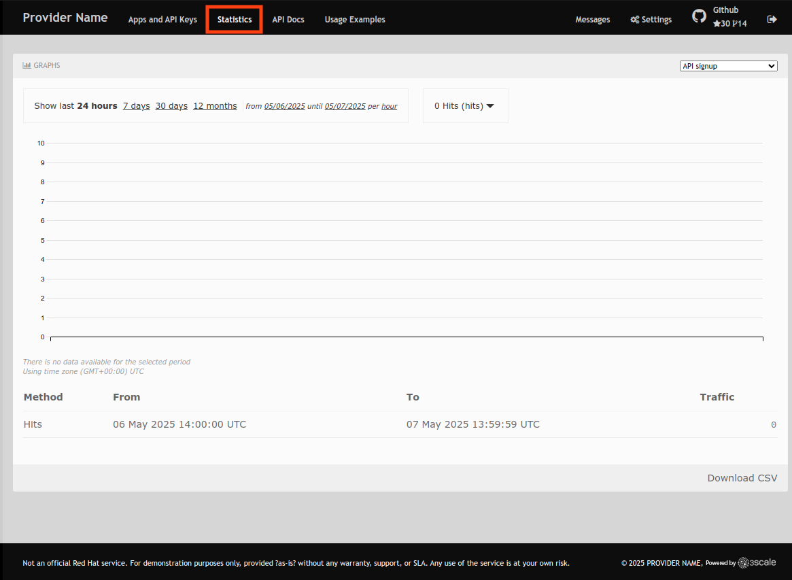
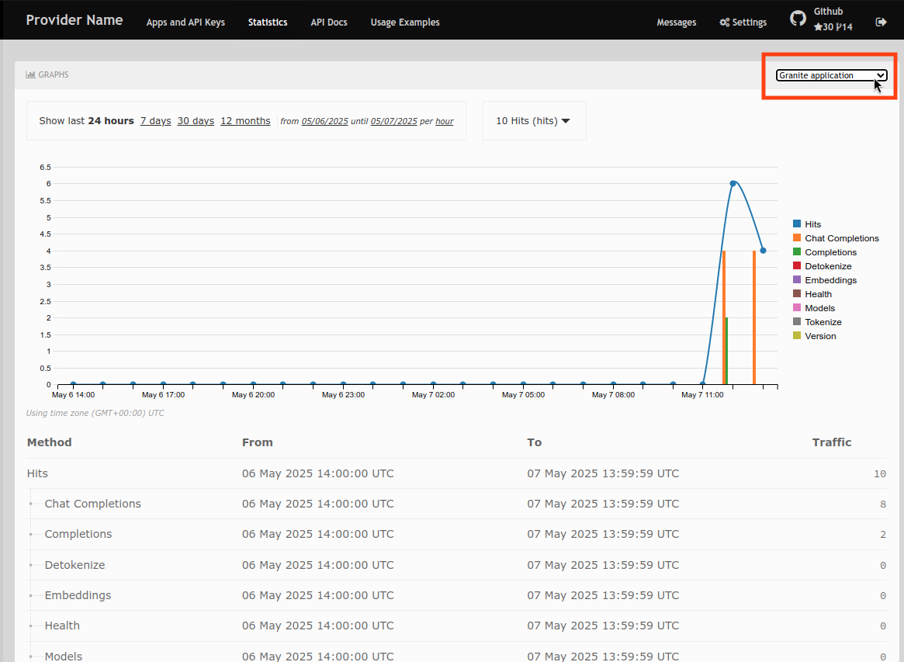

= [Module 4] Analytics and Reporting

Now that you have created, deployed and interacted with AI workloads, how do we now understand our organization's usage, justify cost, and plan for future growth?

This next module focuses on how to measure and monitor the impact of your AI-powered services using API-level analytics from 3scale, as well as the implications of GPU utilization and overall impact to infrastructure costs.

== Why This Matters
As organizations roll out AI services, stakeholders need more than just model quality—they need to know:

* Who’s using it

* How often

* Which services are most active

* How infrastructure usage maps to real cost

This kind of insight enables:

* Cost attribution (per team, per model, per environment)

* Capacity planning (predict future GPU or API scale needs)

* Chargeback/showback for internal billing

* Product insight on model/API usage trends

[#analytics-overview]
== Explore Analytics and Model Usage

Navigate back to the 3Scale Developer Portal dashboard:

//URL to developer portal

* In the 3Scale **developer portal**, navigate to the `Statistics` tab at the top.
+
[.bordershadow]

* You have a drop-down with all the applications you have created. Click on any to view its statistics.
+
[.bordershadow]

As a developer, you can view the statistics of your applications and monitor their usage. You can also view the number of calls made to the API, and the different methods use.

== Compute Utilization

// RHOAI dashboard or console view

== Tying it All Together

// Impact of utilization on overall cost, future decisions, planning, etc.